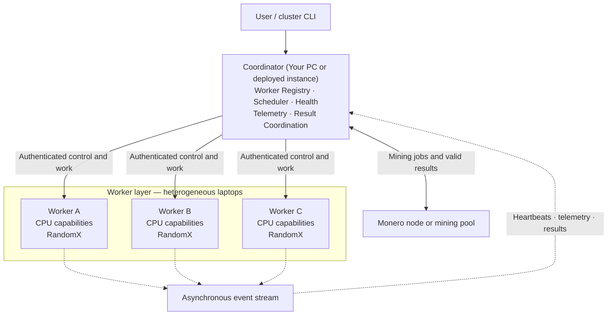

# Distributed Monero CPU Cluster

An open-source distributed computing system for coordinating Monero RandomX workloads across heterogeneous commodity CPUs.

The project allows users to combine authorized laptops, desktops, and other CPU-equipped machines into a coordinated cluster. One machine operates as the coordinator, while the remaining machines join as workers and contribute computational resources when explicitly instructed.

Monero’s CPU-oriented RandomX proof-of-work algorithm provides the project’s primary real-world workload. The main engineering focus is the distributed infrastructure surrounding that workload: networking, coordination, scheduling, concurrency, telemetry, fault handling, and observability.

> **Status:** Early development. RandomX mining and Monero network integration are not implemented yet.

## Overview

The system is designed to provide a simple experience:

1. Start a coordinator.
2. Create a cluster.
3. Install the same project on additional computers.
4. Join those computers to the cluster as workers.
5. Discover each worker’s CPU capabilities.
6. Explicitly start a distributed workload.
7. Coordinate RandomX computation across the available CPUs.
8. Monitor worker and cluster performance in real time.

The project does not attempt to make an individual CPU intrinsically faster. Instead, it combines the independent computational capacity of multiple machines to increase aggregate hashrate.

## Architecture

The system uses one coordinator and multiple heterogeneous worker machines. Workers join the cluster in an idle state and begin RandomX computation only after receiving an explicit authenticated command.



The coordinator manages communication with the selected Monero node or mining pool. It distributes current work to workers, coordinates their search spaces, receives their results, and submits valid results upstream.


The project uses one repository and one codebase. A machine’s runtime command determines whether it operates as the coordinator or as a worker.

## Coordinator

The coordinator is responsible for:

* Cluster initialization
* Worker enrollment and authentication
* Worker registration
* CPU capability discovery
* Worker health and heartbeat tracking
* Workload coordination
* Heterogeneous resource scheduling
* Worker search-space coordination
* Asynchronous telemetry collection
* Cluster-wide metric aggregation
* Failure detection
* Mining-result coordination
* Cluster status and control

The coordinator does not contribute CPU mining resources during the initial implementation.

A future optional mode may allow the coordinator machine to participate as an additional worker.

## Workers

A worker agent is responsible for:

* Joining an existing cluster
* Authenticating with the coordinator
* Reporting its CPU and system capabilities
* Remaining idle until explicitly instructed
* Receiving coordinated work
* Executing RandomX computation
* Reporting mining results
* Sending telemetry and heartbeats
* Respecting CPU, temperature, and battery limits
* Reconnecting after temporary network failures

Joining a cluster does not automatically start a workload.

## Planned CLI

The project will provide a unified command-line interface.

Initialize a coordinator:

```bash
cluster coordinator init
```

Start the coordinator:

```bash
cluster coordinator run
```

Join from another authorized computer:

```bash
cluster worker join <coordinator-address> --token <join-token>
```

View cluster status:

```bash
cluster status
```

Explicitly start or stop the cluster workload:

```bash
cluster start
cluster stop
```

The precise command syntax may evolve as the system is implemented.

## Scheduling

Workers may have significantly different capabilities:

```text
Worker A → 16 threads → 12 kH/s
Worker B →  8 threads →  7 kH/s
Worker C →  4 threads →  3 kH/s
```

The scheduler will account for differences in:

* CPU model and architecture
* Physical and logical core count
* Cache capacity
* Available memory
* Hardware AES support
* NUMA topology
* Large-page support
* Measured RandomX performance
* CPU temperature
* Power-source state
* User-defined resource limits

The scheduler will coordinate resource allocation without assuming every worker has equal computational capacity.

## Telemetry and Observability

Workers will asynchronously report measurements such as:

* Worker identity
* CPU model
* Core and thread count
* CPU utilization
* Memory utilization
* Temperature where available
* Active computation threads
* Current and average hashrate
* Accepted, rejected, and stale results
* Worker errors
* Heartbeats
* Event timestamps

The coordinator will aggregate worker measurements into real-time cluster metrics:

```text
CLUSTER

Workers:              4
Active workers:       4
Total hashrate:       28.4 kH/s
Average CPU usage:    91%
Network overhead:     1.8%
```

Telemetry processing will be designed to tolerate duplicate, delayed, and out-of-order events.

## Technology

The initial implementation will use:

* **Go** for the coordinator, worker agent, and unified CLI
* Authenticated coordinator-worker communication
* A persistent store for cluster and worker state
* An asynchronous event stream for telemetry
* Prometheus-compatible operational metrics
* A web dashboard for cluster visualization
* Actual RandomX computation as the final workload

The RandomX integration strategy will be evaluated separately to balance performance, implementation ownership, cross-platform support, observability, licensing, and development complexity.

## Repository Structure

```text
distributed-monero/
├── cmd/
│   └── cluster/
├── internal/
│   ├── coordinator/
│   ├── worker/
│   ├── protocol/
│   ├── scheduler/
│   ├── telemetry/
│   └── workload/
├── dashboard/
├── docs/
│   └── decisions/
├── tests/
├── .github/
│   └── workflows/
├── go.mod
├── README.md
└── LICENSE
```

Directories will be introduced when their corresponding functionality is implemented.

## Project Principles

* Use actual RandomX computation for final performance measurements.
* Keep the coordinator and worker runtime roles separate.
* Keep worker enrollment separate from workload execution.
* Require explicit authorization before starting CPU work.
* Design for heterogeneous commodity hardware.
* Measure distributed-system overhead honestly.
* Prefer incremental, testable milestones over premature infrastructure.
* Document important architectural decisions and tradeoffs.
* Never describe planned functionality as already implemented.

## Safety and Authorization

This project must only be used on computers the operator owns or has explicit authorization to use.

The project will not implement:

* Hidden execution
* Unauthorized persistence
* Silent resource consumption
* Arbitrary remote shell access
* Credential collection
* Authorization bypasses
* Security-control evasion
* Automatic spreading between machines

Workers must visibly identify themselves, remain idle after enrollment, respect configured resource limits, and require an explicit authenticated coordinator command before beginning computational work.

## License

This project is licensed under the MIT License.
